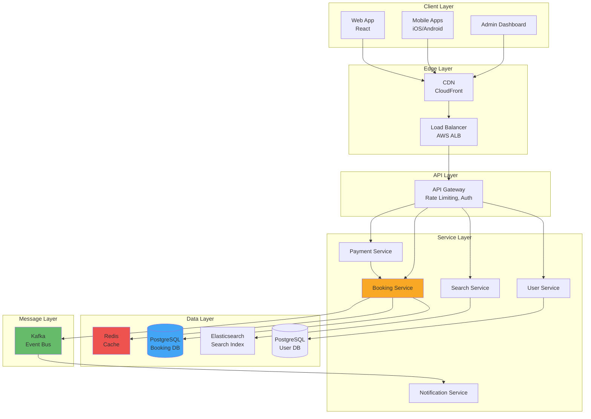
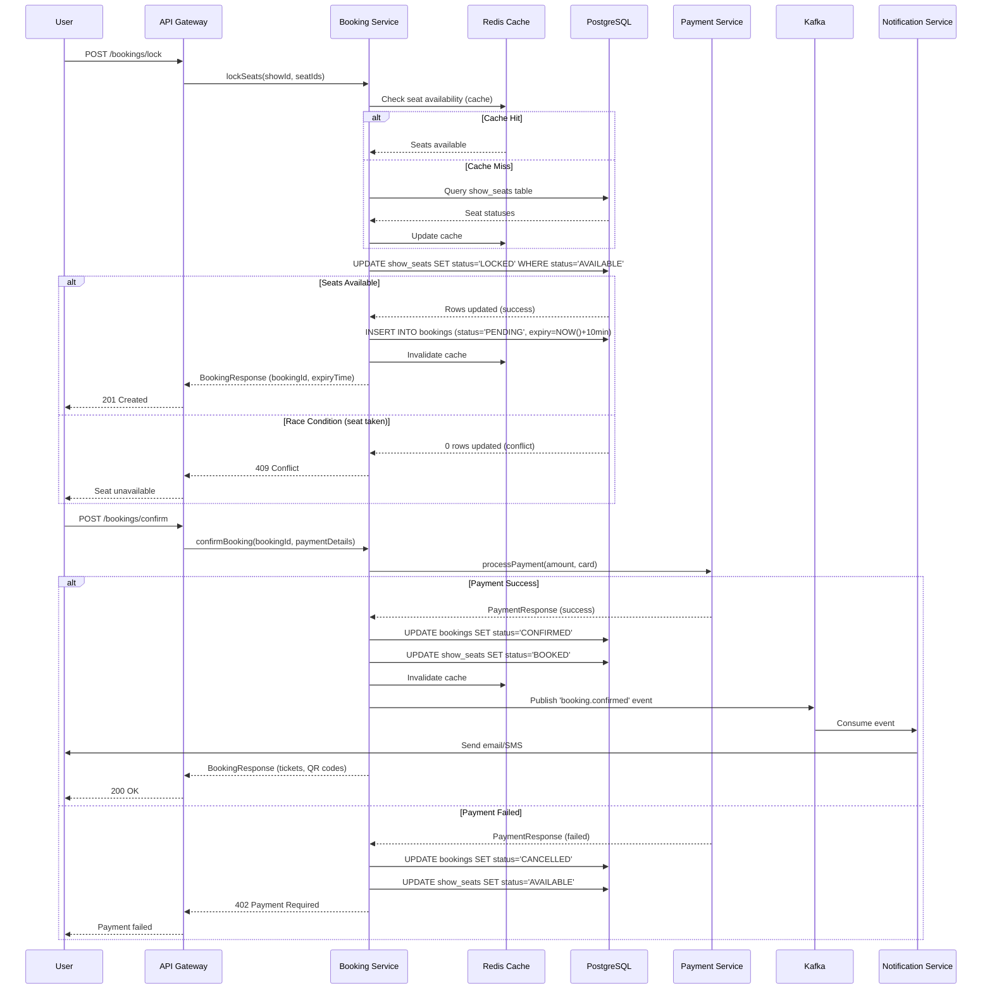
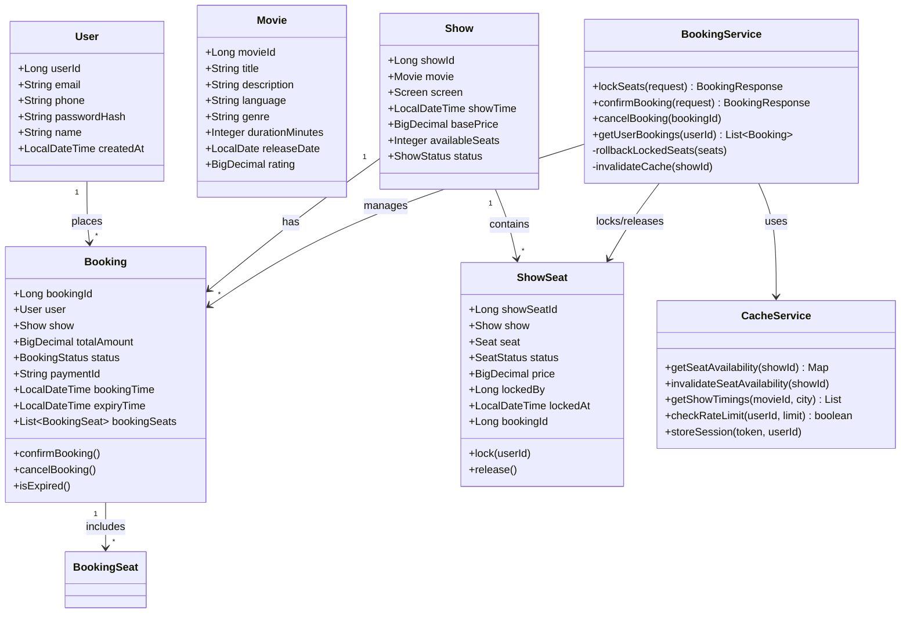

# 🎬 Book My Show - System Design

[](https://www.oracle.com/java/)
[](https://spring.io/projects/spring-boot)
[](https://www.postgresql.org/)
[](https://redis.io/)
[](LICENSE)

> A production-grade ticket booking system designed for high concurrency, strong consistency, and fault tolerance. Inspired by FAANG/MAANG interview system design expectations.

---

## 📖 Overview

**Book My Show** is a scalable online ticket booking platform for movies, events, and concerts. The system handles millions of concurrent users, prevents double-booking through optimistic locking, and ensures ACID compliance for payments.

### Key Features
- ✅ **Real-time Seat Availability** with Redis caching (sub-millisecond latency)
- ✅ **Atomic Seat Locking** using database constraints (no double-booking)
- ✅ **Two-Phase Commit** for payment + booking consistency
- ✅ **Distributed Caching** with cache-aside and write-through strategies
- ✅ **Circuit Breakers & Rate Limiting** for resilience
- ✅ **Horizontal Scalability** via database sharding (geo-based)
- ✅ **Event-Driven Architecture** with Kafka for notifications
- ✅ **Background Jobs** for lock expiry and analytics

### System Metrics
- **Capacity**: 10M+ concurrent users
- **Throughput**: 1,157 bookings/second (peak)
- **Latency**: <200ms API response time
- **Availability**: 99.99% uptime (4 nines)
- **Storage**: 4TB data, 12TB with replication

---

## 🏗️ High-Level Design (HLD)

### Architecture Diagram



### Data Flow: Seat Booking



### Component Responsibilities

| Component | Responsibility | Technology | Scaling Strategy |
|-----------|---------------|------------|------------------|
| **API Gateway** | Rate limiting, auth, routing | Kong/AWS API Gateway | Horizontal (stateless) |
| **User Service** | Registration, login, profiles | Spring Boot + PostgreSQL | Read replicas (5x) |
| **Search Service** | Movie/show search | Spring Boot + Elasticsearch | Horizontal sharding by city |
| **Booking Service** | Seat locking, booking logic | Spring Boot + PostgreSQL | Geo-sharding (city-based) |
| **Payment Service** | Payment processing, refunds | Spring Boot + Stripe | Horizontal with idempotency |
| **Notification Service** | Email/SMS/Push notifications | Spring Boot + SendGrid/Twilio | Async processing (Kafka) |
| **Redis Cache** | Seat availability, sessions | Redis Cluster | 6 nodes (3 masters + 3 replicas) |
| **PostgreSQL** | Transactional data | PostgreSQL 15 | Sharding + read replicas |
| **Kafka** | Event bus for async tasks | Kafka Cluster | Partitioned by userId |

---

## 🔧 Low-Level Design (LLD)

### Database Schema

#### Core Tables

**Users Table**
```sql
CREATE TABLE users (
    user_id BIGSERIAL PRIMARY KEY,
    email VARCHAR(255) UNIQUE NOT NULL,
    phone VARCHAR(20) UNIQUE,
    password_hash VARCHAR(255) NOT NULL,
    name VARCHAR(255),
    created_at TIMESTAMP DEFAULT NOW(),
    updated_at TIMESTAMP DEFAULT NOW()
);
CREATE INDEX idx_email ON users(email);
```

**Bookings Table**
```sql
CREATE TABLE bookings (
    booking_id BIGSERIAL PRIMARY KEY,
    user_id BIGINT REFERENCES users(user_id),
    show_id BIGINT REFERENCES shows(show_id),
    total_amount DECIMAL(10,2),
    booking_status VARCHAR(20) DEFAULT 'PENDING',
    payment_id VARCHAR(255),
    booking_time TIMESTAMP DEFAULT NOW(),
    expiry_time TIMESTAMP, -- Lock expiry (10 minutes)
    INDEX idx_user_booking (user_id, booking_time),
    INDEX idx_expiry (booking_status, expiry_time) WHERE booking_status='PENDING'
);
```

**Show_Seats Table** (Critical for concurrency)
```sql
CREATE TABLE show_seats (
    show_seat_id BIGSERIAL PRIMARY KEY,
    show_id BIGINT REFERENCES shows(show_id),
    seat_id BIGINT REFERENCES seats(seat_id),
    status VARCHAR(20) DEFAULT 'AVAILABLE', -- AVAILABLE, LOCKED, BOOKED
    price DECIMAL(10,2),
    locked_by BIGINT REFERENCES users(user_id),
    locked_at TIMESTAMP,
    booking_id BIGINT,
    UNIQUE(show_id, seat_id), -- Prevent duplicate seat entries
    INDEX idx_show_status (show_id, status)
);
```

### Class Diagram



### Key Classes & Patterns

#### 1. Optimistic Locking (Seat Reservation)

**Pattern**: Optimistic Concurrency Control  
**Problem**: Multiple users selecting same seat simultaneously  
**Solution**: Database-level atomic UPDATE with WHERE clause

```java
// Critical: This UPDATE is atomic - no locks held during user think time
@Modifying
@Query("""
    UPDATE ShowSeat ss
    SET ss.status = 'LOCKED', ss.lockedBy = :userId, ss.lockedAt = :lockedAt
    WHERE ss.show.showId = :showId
      AND ss.seat.seatId = :seatId
      AND ss.status = 'AVAILABLE'
""")
int lockSeat(@Param("showId") Long showId, 
              @Param("seatId") Long seatId, 
              @Param("userId") Long userId, 
              @Param("lockedAt") LocalDateTime lockedAt);

// Returns:
// - 1 if seat was available and locked successfully
// - 0 if seat already locked (race condition detected)
```

**Why this works:**
- `WHERE status='AVAILABLE'` ensures atomicity
- Database isolation level (READ_COMMITTED) prevents dirty reads
- If two transactions try to lock same seat, only one succeeds
- No distributed locks needed (database handles it)

**Alternative Approaches:**

| Approach | Pros | Cons | Verdict |
|----------|------|------|---------|
| **Pessimistic Locking** (SELECT FOR UPDATE) | Strong consistency | Poor concurrency, holds locks during user payment | ❌ Too slow |
| **Distributed Locks** (Redlock) | Scalable, fast | Complex, risk of lost locks | ⚠️ Overkill |
| **Saga Pattern** (Eventual Consistency) | Highly scalable | Complex rollback, not real-time | ❌ Not suitable |
| **Optimistic + DB Constraints** | Simple, reliable, good concurrency | Requires retry logic | ✅ **Chosen** |

---

#### 2. Cache-Aside Pattern (Seat Availability)

**Pattern**: Lazy Loading with Cache Stampede Protection  
**Problem**: 10K users checking same show → DB overload  
**Solution**: Distributed lock ensures only one thread fetches from DB

```java
public Map<Long, String> getSeatAvailability(Long showId, DataLoader<Map<Long, String>> dataLoader) {
    String cacheKey = "show:seats:" + showId;
    
    try (Jedis jedis = jedisPool.getResource()) {
        // 1. Try cache (O(1) lookup)
        Map<String, String> cachedData = jedis.hgetAll(cacheKey);
        if (!cachedData.isEmpty()) {
            return convertToLongMap(cachedData); // Cache HIT
        }
        
        // 2. Cache MISS - acquire distributed lock
        String lockKey = "lock:" + cacheKey;
        String lockAcquired = jedis.set(lockKey, "1", SetParams.setParams().nx().ex(10));
        
        if ("OK".equals(lockAcquired)) {
            // This thread acquired the lock - fetch from DB
            try {
                Map<Long, String> data = dataLoader.load(); // DB query
                
                // 3. Populate cache
                jedis.hset(cacheKey, convertToStringMap(data));
                jedis.expire(cacheKey, 300); // 5-minute TTL
                return data;
            } finally {
                jedis.del(lockKey); // Release lock
            }
        } else {
            // Another thread is fetching - wait and retry
            Thread.sleep(100);
            return getSeatAvailability(showId, dataLoader); // Retry
        }
    }
}
```

**Cache Invalidation Strategy:**
- **Write-Through**: Update DB → Invalidate cache immediately
- **TTL**: Auto-expire after 5 minutes (safety net)
- **Pub/Sub**: Broadcast `seat.updated` event to all instances

---

#### 3. Two-Phase Commit (Payment + Booking)

**Pattern**: Distributed Transaction with Idempotency  
**Problem**: Payment succeeds but booking update fails → inconsistency  
**Solution**: Idempotent payment + rollback on failure

```java
@Transactional
public BookingResponse confirmBooking(ConfirmBookingRequest request) {
    // Phase 1: Prepare (validate booking)
    Booking booking = bookingRepository.findById(request.getBookingId())
        .orElseThrow(() -> new BookingNotFoundException("Booking not found"));
    
    if (booking.getExpiryTime().isBefore(LocalDateTime.now())) {
        cancelBooking(booking.getBookingId());
        throw new BookingExpiredException("Lock expired");
    }
    
    // Phase 2: Commit (process payment)
    PaymentResponse paymentResponse;
    try {
        paymentResponse = paymentService.processPayment(
            PaymentRequest.builder()
                .bookingId(booking.getBookingId())
                .amount(booking.getTotalAmount())
                .idempotencyKey(booking.getBookingId().toString()) // Prevent double-charge
                .build()
        );
    } catch (Exception e) {
        // Rollback: Cancel booking and release seats
        cancelBooking(booking.getBookingId());
        throw new PaymentFailedException("Payment failed: " + e.getMessage());
    }
    
    if (paymentResponse.getStatus() != PaymentStatus.SUCCESS) {
        cancelBooking(booking.getBookingId());
        throw new PaymentFailedException("Payment declined");
    }
    
    // Phase 3: Finalize (update booking)
    booking.setBookingStatus(BookingStatus.CONFIRMED);
    booking.setPaymentId(paymentResponse.getPaymentId());
    bookingRepository.save(booking);
    
    // Update seats to BOOKED (permanent)
    showSeatRepository.updateSeatsStatus(
        booking.getBookingSeats().stream()
            .map(bs -> bs.getShowSeat().getShowSeatId())
            .toList(),
        SeatStatus.BOOKED,
        booking.getBookingId()
    );
    
    return buildBookingResponse(booking);
}
```

**Idempotency Key:**
- Uses `bookingId` as idempotency key
- Payment gateway deduplicates retries (network failures)
- Safe to call multiple times (returns same result)

---

#### 4. Background Job (Lock Expiry Worker)

**Pattern**: Scheduled Job with Batch Processing  
**Problem**: Users abandon payment → seats stuck in LOCKED state  
**Solution**: Cron job releases expired locks every minute

```java
@Scheduled(fixedDelay = 60000, initialDelay = 10000) // Every 60s
@Transactional
public void expireBookings() {
    // 1. Find expired bookings (batch of 100)
    List<Booking> expiredBookings = bookingRepository.findExpiredBookings(
        BookingStatus.PENDING,
        LocalDateTime.now()
    );
    
    if (expiredBookings.isEmpty()) {
        return;
    }
    
    logger.info("Found {} expired bookings to cancel", expiredBookings.size());
    
    // 2. Cancel each booking (releases seats, invalidates cache)
    for (Booking booking : expiredBookings) {
        try {
            bookingService.cancelBooking(booking.getBookingId());
        } catch (Exception e) {
            logger.error("Failed to cancel booking {}", booking.getBookingId(), e);
        }
    }
}
```

**Why Scheduled Job?**
- Simple, reliable, no external dependencies
- Acceptable delay: Seats released within 1 min of expiry
- Alternative: Redis TTL + Pub/Sub (more complex, less reliable)

---

### API Endpoints

#### Booking APIs

```http
POST /api/v1/bookings/lock
Content-Type: application/json
Authorization: Bearer <token>

{
  "showId": 12345,
  "seatIds": [101, 102, 103]
}

Response: 201 Created
{
  "success": true,
  "data": {
    "bookingId": "BKG123456",
    "status": "LOCKED",
    "expiryTime": "2024-01-15T10:15:00Z",
    "totalAmount": 450.00,
    "seats": [
      {"seatId": 101, "seatNumber": "A1", "price": 150.00},
      {"seatId": 102, "seatNumber": "A2", "price": 150.00},
      {"seatId": 103, "seatNumber": "A3", "price": 150.00}
    ]
  }
}
```

```http
POST /api/v1/bookings/confirm
Content-Type: application/json
Authorization: Bearer <token>

{
  "bookingId": "BKG123456",
  "paymentMethod": "CARD",
  "paymentDetails": {
    "cardToken": "tok_abc123",
    "cardLast4": "1234"
  }
}

Response: 200 OK
{
  "success": true,
  "data": {
    "bookingId": "BKG123456",
    "status": "CONFIRMED",
    "paymentId": "PAY789012",
    "tickets": [
      {
        "ticketId": "TKT001",
        "seatNumber": "A1",
        "qrCode": "data:image/png;base64,..."
      }
    ]
  }
}
```

---

## 🚀 Setup Instructions

### Prerequisites
- **Java 17+**
- **Maven 3.8+**
- **Docker & Docker Compose**
- **PostgreSQL 15**
- **Redis 7.0**
- **Kafka 3.5**

### Local Development Setup

```bash
# 1. Clone repository
git clone https://github.com/yourusername/bookmyshow.git
cd bookmyshow

# 2. Start infrastructure (PostgreSQL, Redis, Kafka)
docker-compose up -d

# 3. Create database and run migrations
psql -U postgres -c "CREATE DATABASE bookmyshow;"
mvn flyway:migrate

# 4. Build project
mvn clean install

# 5. Run application
mvn spring-boot:run

# 6. Access application
# API: http://localhost:8080/api/v1
# Swagger UI: http://localhost:8080/swagger-ui.html
# Actuator: http://localhost:8080/actuator
```

### Docker Compose Configuration

```yaml
version: '3.8'

services:
  postgres:
    image: postgres:15-alpine
    ports:
      - "5432:5432"
    environment:
      POSTGRES_USER: postgres
      POSTGRES_PASSWORD: password
      POSTGRES_DB: bookmyshow
    volumes:
      - postgres_data:/var/lib/postgresql/data
  
  redis:
    image: redis:7.0-alpine
    ports:
      - "6379:6379"
    command: redis-server --appendonly yes
    volumes:
      - redis_data:/data
  
  kafka:
    image: confluentinc/cp-kafka:7.5.0
    ports:
      - "9092:9092"
    environment:
      KAFKA_BROKER_ID: 1
      KAFKA_ZOOKEEPER_CONNECT: zookeeper:2181
      KAFKA_ADVERTISED_LISTENERS: PLAINTEXT://localhost:9092
      KAFKA_OFFSETS_TOPIC_REPLICATION_FACTOR: 1
  
  zookeeper:
    image: confluentinc/cp-zookeeper:7.5.0
    ports:
      - "2181:2181"
    environment:
      ZOOKEEPER_CLIENT_PORT: 2181

volumes:
  postgres_data:
  redis_data:
```

### Running Tests

```bash
# Unit tests
mvn test

# Integration tests (requires Docker)
mvn verify

# Load tests (using Gatling)
mvn gatling:test

# Code coverage
mvn jacoco:report
# Report: target/site/jacoco/index.html
```

---

## 📊 Observability & Monitoring

### Metrics (Prometheus + Grafana)

**Key Metrics:**
```yaml
# Golden Signals
- http_server_requests_seconds{uri="/api/v1/bookings/lock"} # Latency (P50, P95, P99)
- http_server_requests_total{status="2xx"} # Traffic (requests/sec)
- http_server_requests_total{status="5xx"} # Errors (error rate)
- system_cpu_usage # Saturation (CPU utilization)

# Business Metrics
- bookings_created_total # Total bookings
- bookings_confirmed_total # Conversion rate
- seats_locked_total # Seat locks
- seats_expired_total # Abandoned bookings
- payment_success_rate # Payment success %
```

**Grafana Dashboard:**
```json
{
  "dashboard": {
    "title": "BookMyShow - Booking Service",
    "panels": [
      {
        "title": "Booking Rate",
        "targets": ["rate(bookings_created_total[5m])"]
      },
      {
        "title": "API Latency (P95)",
        "targets": ["histogram_quantile(0.95, http_server_requests_seconds_bucket)"]
      },
      {
        "title": "Error Rate",
        "targets": ["rate(http_server_requests_total{status=~'5..'}[5m])"]
      }
    ]
  }
}
```

### Logging (ELK Stack)

**Structured Logging:**
```java
logger.info("Booking confirmed", 
    keyValue("bookingId", bookingId),
    keyValue("userId", userId),
    keyValue("amount", amount),
    keyValue("duration", duration)
);

// Output (JSON):
{
  "timestamp": "2024-01-15T10:05:23.456Z",
  "level": "INFO",
  "message": "Booking confirmed",
  "bookingId": "BKG123456",
  "userId": 67890,
  "amount": 450.00,
  "duration": 235,
  "traceId": "abc123def456",
  "spanId": "789ghi012jkl"
}
```

### Distributed Tracing (Jaeger)

**Trace Example:**
```
bookings/lock (250ms)
  ├─ validate_show (5ms)
  ├─ check_cache (2ms)
  ├─ lock_seats (120ms) ← Bottleneck!
  │   ├─ db_query (100ms)
  │   └─ cache_invalidate (20ms)
  ├─ create_booking (15ms)
  └─ response (3ms)
```

### Alerting (PagerDuty)

**Alert Rules:**
```yaml
groups:
  - name: booking_service
    rules:
      - alert: HighErrorRate
        expr: rate(http_server_requests_total{status=~"5.."}[5m]) > 0.05
        for: 5m
        labels:
          severity: P1
        annotations:
          summary: "Error rate > 5% for 5 minutes"
      
      - alert: DatabaseConnectionPoolExhausted
        expr: hikaricp_connections_active / hikaricp_connections_max > 0.9
        for: 2m
        labels:
          severity: P0
        annotations:
          summary: "DB connection pool > 90% for 2 minutes"
      
      - alert: PaymentGatewayDown
        expr: up{job="payment_service"} == 0
        for: 1m
        labels:
          severity: P0
        annotations:
          summary: "Payment service unreachable"
```

---

## 🧩 Design Patterns & Rationale

### 1. Service Layer Pattern

**Purpose:** Encapsulate business logic, coordinate between repositories and external services  
**Example:** `BookingService` orchestrates seat locking, payment, and notifications

**Alternatives:**
- **Transaction Script:** Simple, but logic scattered across controllers (hard to test)
- **Domain Model:** Rich domain objects, but complex for this use case
- **Chosen:** Service Layer - balance between simplicity and maintainability

---

### 2. Repository Pattern

**Purpose:** Abstract data access, decouple business logic from persistence  
**Example:** `BookingRepository` provides `findExpiredBookings()` method

**Alternatives:**
- **Active Record:** Models handle their own persistence (tight coupling)
- **Data Mapper:** Full ORM control, but boilerplate-heavy
- **Chosen:** Repository - clean separation, testable with mocks

---

### 3. DTO (Data Transfer Object) Pattern

**Purpose:** Define API contracts, decouple internal models from external representation  
**Example:** `LockSeatsRequest`, `BookingResponse`

**Alternatives:**
- **Expose Domain Entities:** Simple, but leaks internal structure, breaks encapsulation
- **GraphQL:** Client-defined queries, but adds complexity
- **Chosen:** DTOs - explicit contracts, versioning support

---

### 4. Circuit Breaker Pattern (Resilience4j)

**Purpose:** Fail fast when downstream service is unhealthy, prevent cascading failures  
**Example:** Payment service failures open circuit → stop calling payment API

**Configuration:**
```java
@CircuitBreaker(
    name = "paymentService",
    fallbackMethod = "paymentFallback"
)
public BookingResponse confirmBooking(ConfirmBookingRequest request) {
    // Call payment service
}

// Fallback method
public BookingResponse paymentFallback(ConfirmBookingRequest request, Exception e) {
    // Return user-friendly error
    throw new PaymentFailedException("Payment service unavailable. Please try again later.");
}
```

**States:**
- **Closed:** Normal operation (all requests pass through)
- **Open:** Service failing (fail fast, return error immediately)
- **Half-Open:** Test if service recovered (allow 1 request)

**Alternatives:**
- **Retry Logic:** Simple, but wastes resources on failing service
- **Timeout:** Prevents hanging, but still makes slow calls
- **Chosen:** Circuit Breaker - stops calling failing service, saves resources

---

### 5. Cache-Aside Pattern

**Purpose:** Improve performance by caching frequently accessed data  
**Example:** Seat availability cached in Redis (5-min TTL)

**Flow:**
1. Check cache (fast path)
2. Cache miss → Fetch from DB
3. Populate cache
4. Return data

**Alternatives:**
- **Write-Through:** Update cache + DB together (consistent but slower writes)
- **Write-Behind:** Update cache, async DB write (fastest but risky)
- **Chosen:** Cache-Aside - best read performance, simple invalidation

---

### 6. Event-Driven Architecture (Kafka)

**Purpose:** Decouple services, enable asynchronous processing  
**Example:** Booking confirmed → Publish event → Notification service sends email

**Benefits:**
- **Scalability:** Notification service scales independently
- **Reliability:** Kafka persists events (delivery guaranteed)
- **Extensibility:** Add analytics service without changing the booking service

**Alternatives:**
- **Synchronous API calls:** Simple, but tight coupling, slower response
- **HTTP webhooks:** Async, but no delivery guarantee
- **Chosen:** Kafka - reliable, scalable, industry-standard

---

## 📚 Interview Q&A

### Q1: How do you prevent double-booking?

**Answer:**  
Use **optimistic locking** with database constraints. The key is an atomic UPDATE query:

```sql
UPDATE show_seats 
SET status = 'LOCKED', locked_by = :userId 
WHERE show_id = :showId 
  AND seat_id = :seatId 
  AND status = 'AVAILABLE';
```

If two users try to book the same seat simultaneously:
- User A's UPDATE succeeds (returns 1 row updated)
- User B's UPDATE fails (returns 0 rows) because the seat is no longer 'AVAILABLE'
- User B gets a "Seat unavailable" error and must select another seat

**Why not pessimistic locking (SELECT FOR UPDATE)?**  
Pessimistic locking holds database locks during the entire payment flow (could be 5+ minutes). This kills concurrency and causes lock timeouts.

**Why not distributed locks (Redis Redlock)?**  
Adds complexity, requires external coordination. Database constraints are simpler and more reliable.

---
